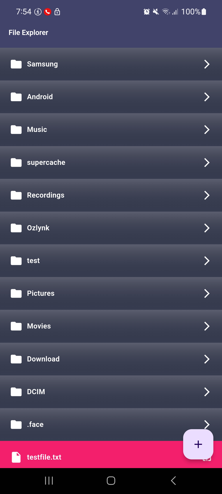

# file_manager_project

A File manager application

1) The application should have a home screen that displays the files and folders in the device's root directory.
2) The user should be able to navigate through the directories and view the files and folders inside them.
3) The user should be able to create new files and folders in the selected directory.
4) The developer should write unit tests for the application's logic and functionality.

## Screenshots

To install this project, follow these steps:

1. Clone the repository.
2. Run `flutter pub get`.
3. Run `flutter run -v`.

